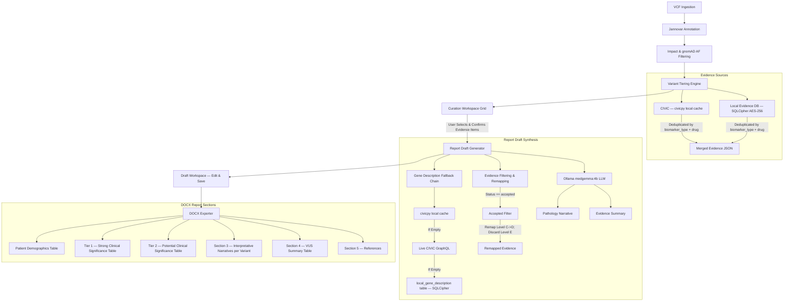

# BEES: Sovereign Genomic Variant Curation & Interpretation Pipeline

**BEES** (Bioinformatics Evidence Evaluation System) is a sovereign, HIPAA-compliant genomic variant curation and clinical reporting pipeline. It processes somatic VCFs, tier-classifies variants under **AMP/ASCO/CAP** guidelines, aggregates local and live evidence from CIViC and a curated local evidence database, and synthesizes draft clinical pathology reports using a local LLM (`medgemma:4b` via Ollama).

All data is stored and processed locally — **no patient data leaves the machine**.

---

## 1. System Architecture



---

## 2. Server Startup

The pipeline requires two active services: **Ollama** (local LLM) and **Uvicorn** (FastAPI server).

### Step 1: Environment Setup
```bash
chmod +x setup_env.sh
./setup_env.sh
```
This detects hardware (NVIDIA/Apple Silicon), verifies Ollama, and pulls `medgemma:4b`.

### Step 2: Start the LLM Daemon
```bash
ollama serve
```

### Step 3: Start the Application Server
```bash
conda run -n clinical_pipeline uvicorn app.main:app --host 127.0.0.1 --port 8000 --reload
```

On startup you will see a confirmation banner:
```
============================================================
  ██████╗ ███████╗███████╗███████╗
  ██╔══██╗██╔════╝██╔════╝██╔════╝
  ██████╔╝█████╗  █████╗  ███████╗
  ██╔══██╗██╔══╝  ██╔══╝  ╚════██║
  ██████╔╝███████╗███████╗███████║
  ╚═════╝ ╚══════╝╚══════╝╚══════╝

  BEES — Bioinformatics Evidence Evaluation System
  Version: 2.0 | Sovereign Clinical Genomics Pipeline
============================================================
  ✓  Database schema initialized
  ✓  Driver genes loaded
  ✓  CIViC cache preloaded
  ✓  Server ready at http://127.0.0.1:8000
  ✓  API docs at   http://127.0.0.1:8000/docs
============================================================
```

- **Dashboard:** `http://127.0.0.1:8000`
- **API Docs (Swagger):** `http://127.0.0.1:8000/docs`

---

## 3. Database Schema

The system operates two local databases:

```
BEES_v2/
├── clinical_pipeline.db        ← Plain SQLite: Case metadata, variants, drafts
└── Var_DB/
    └── clinical_evidence.db    ← SQLCipher AES-256: Evidence records & gene descriptions
```

### A. Case Database (`clinical_pipeline.db`)
Stores clinical case metadata, survived and confirmed variants, and saved report drafts.

- **Auto-migrations** run at startup for schema upgrades.
- **Demographics:** 13 clinical report fields (5 auto-populated from VCF metadata, 8 manually curated).

### B. Encrypted Evidence Database (`Var_DB/clinical_evidence.db`)
Encrypted at rest using **SQLCipher (AES-256)**. Passphrase: `bees_secure_evidence_cipher_key_2026`.

Contains three tables:

| Table | Description |
|---|---|
| `local_evidence` | Curated precision oncology evidence records per gene/variant |
| `local_gene_description` | Gene-level clinical significance text & references (16,376 genes) |

#### Seeding / Updating Local Evidence Records:
```bash
conda run -n clinical_pipeline python create_evidence_db.py
```

#### Migrating Gene Descriptions (one-time):
```bash
conda run -n clinical_pipeline python migrate_gene_descriptions.py
```
This parses all `Gene_Desc/*.txt` files and upserts them into the `local_gene_description` table in the encrypted database.

---

## 4. Key Functional Features

### A. Evidence Deduplication
Evidence items from CIViC and the local database are merged and deduplicated by `(biomarker_type, drug)`. Duplicate rows are collapsed to a single representative (highest tier/level), with all unique PMIDs merged into a semicolon-separated string.

### B. Biomarker Type Standardization
A `standardize_biomarker_type` helper normalizes known spelling variants (e.g. `progonstic` → `prognostic`) from all data sources before processing or display.

### C. Fine-Grained Evidence Selection
The curation grid tracks each evidence item individually using `hgvsg::index` keys. A user can drop a single evidence entry (e.g., one specific drug response row) without removing the entire variant from the report.

### D. Tier Classification Rules
- **Tier 1 A/B:** Evidence directly matching the case's disease indication (DOID).
- **Tier 1 A/B → Tier 2C:** When the disease indication does not match the case's DOID, the item is downgraded to Tier 2C.
- **Minimum AF Filter:** Variants with sample allele frequency below 5% are hidden by default.
- **gnomAD AF Filter:** Common germline variants (gnomAD AF ≥ 1%) are excluded.

### E. DOCX Report Structure
Generated reports contain six sections:
1. **Patient Demographics** — 13-field grid.
2. **Variant Summary Tables** — Split Tier 1 / Tier 2 tables with columns: Gene, cDNA, Protein, HGVSg, Consequence, Level, Biomarker Type, Drug, Response, Evidence.
3. **Interpretative Narratives** — Ordered Tier 1 first, then Tier 2. Each variant includes: Gene Summary, Variant Summary, Evidence Summary with a compact inline table and EIDs.
4. **Variants of Unknown Significance (VUS)** — Tier 3 summary table.
5. **References** — Sequentially renumbered reference list from all narrative sections.

### F. Gene Description Fallback Chain
For each Tier 1/2 variant, gene clinical descriptions are resolved in order:
1. **civicpy** local gene cache.
2. **Live CIViC GraphQL** query (if cache empty).
3. **`local_gene_description` table** (SQLCipher encrypted, 16,376 genes).
4. Fallback message if none found.

### G. Evidence Level Remapping (LLM Synthesis)
Before LLM narrative synthesis, evidence undergoes QC preprocessing:
- Level `A` and `B` are retained as-is.
- Level `C` is remapped to `Level D`.
- Level `E` is discarded entirely.
- Items not marked `accepted` are silently filtered.

### H. Native Markdown → Word Converter
Narrative markdown text from report drafts is parsed and converted to native `.docx` paragraph objects:
- `#` / `##` / `###` → Heading 1/2/3 styles (Arial, slate palette).
- `- ` / `1.` → Bullet / Numbered list.
- `**bold**` / `*italic*` / `[text](url)` → Styled text runs with hyperlinks.

---

## 5. Variant Pipeline Flow

```
VCF Input
  └── Jannovar annotation (Ensembl/RefSeq hg38)
      └── cyvcf2 PASS/. filter + HIGH/MODERATE impact filter
          └── vcfanno gnomAD AF annotation
              └── AF < 1% filter
                  └── filtered_variants saved to DB
                      └── tier_case_variants() — CIViC + Local DB lookup & merge
                          └── Curation grid → User confirms evidence items
                              └── confirmed_variants saved
                                  └── LLM synthesis (Ollama medgemma:4b)
                                      └── DOCX export
```

---

## 6. Running Database Utilities

| Task | Command |
|---|---|
| Seed local evidence records | `conda run -n clinical_pipeline python create_evidence_db.py` |
| Migrate gene descriptions | `conda run -n clinical_pipeline python migrate_gene_descriptions.py` |
| Create admin user | `conda run -n clinical_pipeline python create_admin.py` |
